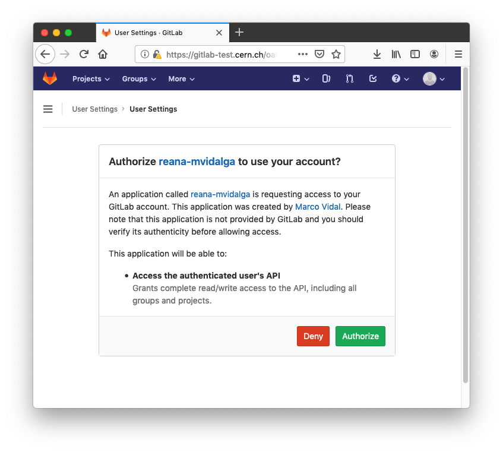

.. _developerguide:

Developer guide
===============

Quick start
-----------

This guide explains how to locally-start REANA-UI, with reloading activated:

1. Clone reana-ui Github project into your computer

   .. code-block:: console

      $ git clone https://github.com/reanahub/reana-ui.git

2. Install all the project dependencies:

   .. code-block:: console

      $ cd reana-ui/reana-ui
      $ npm install

3. Launch the web server

   .. code-block:: console

      $ npm start
      ...
      Compiled successfully!

      You can now view reana-ui in the browser.

        http://localhost:3000/

      Note that the development build is not optimized.
      To create a production build, use npm run build.

4. Open the browser in localhost:3000 (address by default)

Code style
----------

We are using Prettier to format our code. In order to use it before a Pull Request:

1. Install the package from NPM

   .. code-block:: console

      $ npm install prettier

2. Style your code

   .. code-block:: console

      $ prettier --write **/*.js

CERN integrations locally
-------------------------

Prerequisites
~~~~~~~~~~~~~

* Be inside the CERN network.
* Set port forwarding from your machine to the VM where REANA runs. The supported way
  of doing so is using VirtualBox VM driver for Minikube. To set it up you can follow
  the next steps:

  * Go to the VirtualBox UI and select the running VM, then in the *Network* section
    select *Advanced* > *Port Forwarding*

    .. image:: _static/virtualbox-port-forwarding.png

  * Add a new entry (in the screenshot ``reana-backend``) to forward all the requests going to the port
    443 (default for HTTPS) to the internal port 30443 (where REANA-Server is listening).

Authentication
~~~~~~~~~~~~~~
REANA-UI uses Single Sign-On (SSO) for Authentication.

1. `Register <https://sso-management.web.cern.ch/OAuth/RegisterOAuthClient.aspx>`_ an OAuth client.

  * ``client_id``: A unique text string that identifies your client, e.g. ``reana-johndoe``.
  * ``redirect_id``: Your REANA-Server hostname followed by ``/oauth/authorized/cern/``,
    e.g. ``https://reana-johndoe.cern.ch/oauth/authorized/cern/``
  * Application Homepage: Your REANA-Server hostname, e.g. ``https://reana-johndoe.cern.ch``.
  * Description: Whatever description you like.

2. Edit REANA-UI's `config.js <https://github.com/reanahub/reana-ui/blob/master/reana-ui/src/config.js#L14>`_:
  * ``api``: REANA-Server hostname, e.g. ``https://reana-johndoe.cern.ch``.

3. Configure SSO-related REANA-Cluster environment variables. You can do this in two ways:

   * Setting the variables before deploying on
     `reana-cluster.yaml <https://github.com/reanahub/reana-cluster/blob/master/reana_cluster/configurations/reana-cluster-minikube-dev.yaml>`_.
   * Changing the variable names directly on the REANA-Server deployment if you made a mistake and
     you don't want to deploy REANA again:

    .. code-block:: console

      $ kubectl set env deployment/server CERN_CONSUMER_KEY=reana-johndoe CERN_CONSUMER_SECRET=<my-generated-secret>

* ``CERN_CONSUMER_KEY``: ``client_id`` of your OAuth client previously registered.
* ``CERN_CONSUMER_SECRET``:  Generated secret, it can be consulted
  `here <https://sso-management.web.cern.ch/OAuth/ListOAuthClients.aspx>`_ clicking on the *[Manage]*
  link of the your corresponding OAuth client.

4. Now you should be able to login into REANA-UI. You will be redirected to the CERN SSO page to
   enter your credentials and then back to REANA-UI site.

GitLab integration
~~~~~~~~~~~~~~~~~~

To setup the GitLab integration locally you need to follow these steps:

1. Create an application on `gitlab-test.cern.ch <https://gitlab-test.cern.ch>`_, to do that go to
   *Settings > Applications*:
  * Name: Application name, e.g. ``reana-jonhdoe``.
  * Redirect URI: Your hostname followed by ``/api/gitlab`` e.g. ``https://reana-johndoe.cern.ch/api/gitlab``
  Select ``api`` scope and *Save application*.

2. Configure GitLab-related REANA-Cluster environment variables. You can do this directly on the
   `reana-cluster.yaml <https://github.com/reanahub/reana-cluster/blob/master/reana_cluster/configurations/reana-cluster-minikube-dev.yaml>`_:

.. code-block:: diff

      cluster:
      type: "kubernetes"
      + reana_url: <hostname> # e.g. "reana-johndoe.cern.ch"
      ...
      reana-workflow-controller:
      type: "docker"
      image: "reanahub/reana-workflow-controller:latest"
      mountpoints:
        - type: hostPath
        name: reana-workflow-controller-code
        path: "/code/reana-workflow-controller:/code"
      environment:
      ...
      + - REANA_GITLAB_HOST: "gitlab-test.cern.ch"
      ...
      reana-server:
      type: "docker"
      image: "reanahub/reana-server:latest"
      mountpoints:
        - type: hostPath
        name: reana-server-code
        path: "/code/reana-server:/code"
      environment:
      ...
      + - REANA_GITLAB_OAUTH_APP_ID: "<GitLab-Application-ID>"
      + - REANA_GITLAB_OAUTH_APP_SECRET: "<GitLab-Secret>"
      + - REANA_GITLAB_HOST: "gitlab-test.cern.ch"

* ``REANA_GITLAB_OAUTH_APP_ID``: ID generated when the application is created. It can be consulted on the GitLab application page.
* ``REANA_GITLAB_OAUTH_APP_SECRET``: Secret generated when the application is created. It can be consulted on the GitLab application page.
* ``REANA_GITLAB_HOST``: GitLab instance URL, e.g. ``gitlab-test.cern.ch``

3. Rebuild the image and deploy:

.. code-block:: console

  $ cd reana/
  $ CLUSTER_CONFIG=dev make build
  $ # Replace reana-johndoe with your machine's hostname
  $ CLUSTER_FLAGS=--ui SERVER_URL=https://reana-johndoe.cern.ch \
    CLUSTER_CONFIG=dev make deploy

4. Run REANA-UI as described in the `Quick start`_ section, log in and go to the projects page.
   Click on *Connect with GitLab* and you will be redirected to a page like this one:

.. important::

  Take into account that you should access your REANA-UI site with your
  hostname instead of http://localhost:3000, e.g. http://reana-johndoe.cern.ch:3000.
  Otherwise the SSO and GitLab integrations won't work as expected.

5. Authorize the GitLab application and you will be able to see all your GitLab projects.
   Select any of them and click on *Connect project*. A webhook will be created for this
   repository so whenever you push some changes to it, as long as it is REANA-compatible
   and it has a ``reana.yaml`` file, a workflow will be started updating the commit status.

   .. image:: _static/commit-status-running.png
   .. image:: _static/commit-status-passed.png
